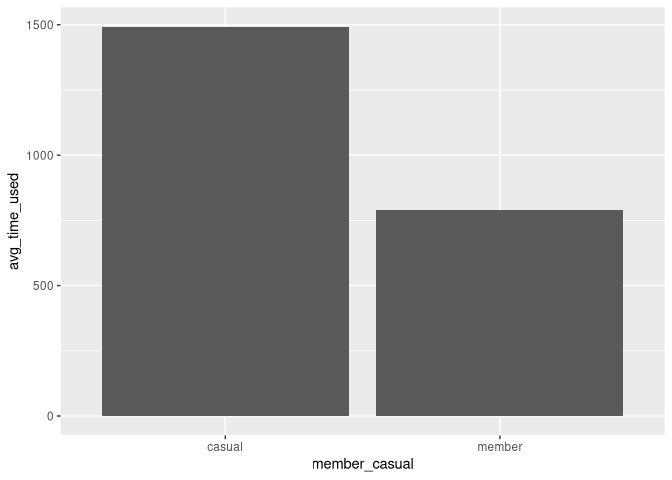
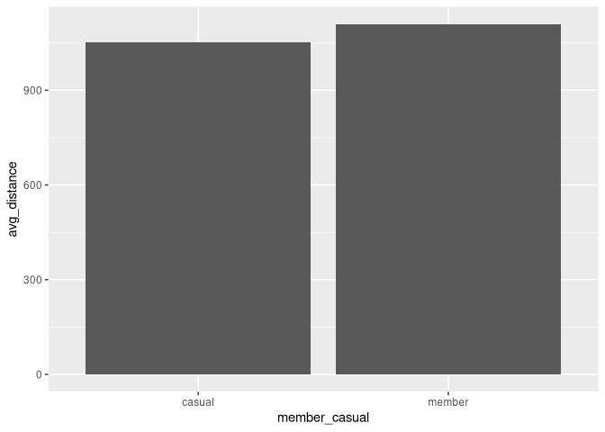
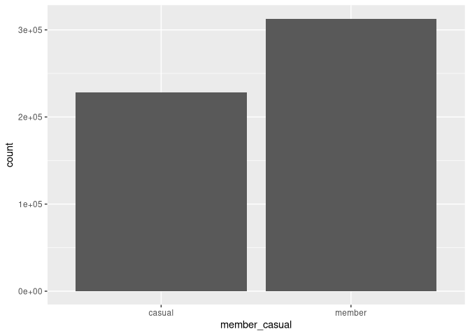
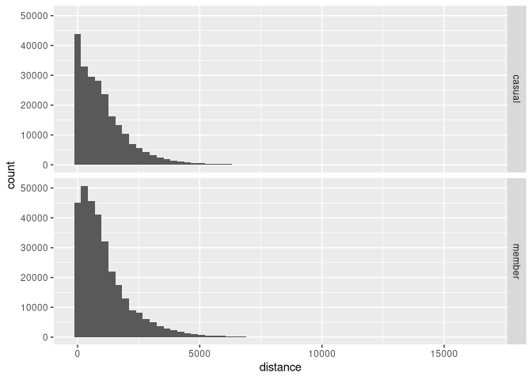
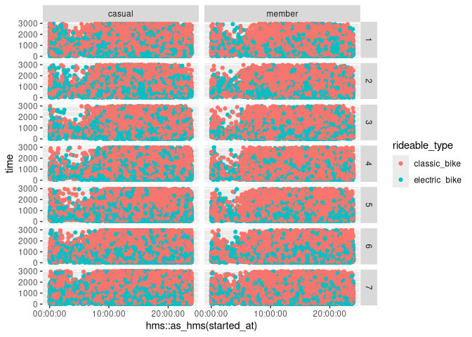
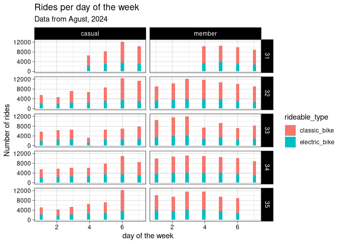
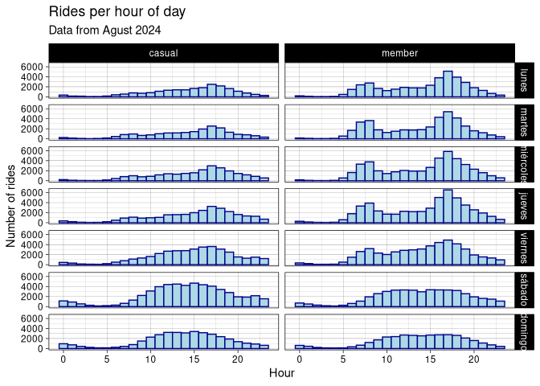

# Cyclist data analysis


# Preparing control

first, we will prepare the necesary libraries to make an initial
exploration

``` r
library(tidyverse)
```

    ── Attaching core tidyverse packages ──────────────────────── tidyverse 2.0.0 ──
    ✔ dplyr     1.1.4     ✔ readr     2.1.5
    ✔ forcats   1.0.0     ✔ stringr   1.5.1
    ✔ ggplot2   3.5.1     ✔ tibble    3.2.1
    ✔ lubridate 1.9.3     ✔ tidyr     1.3.1
    ✔ purrr     1.0.2     
    ── Conflicts ────────────────────────────────────────── tidyverse_conflicts() ──
    ✖ dplyr::filter() masks stats::filter()
    ✖ dplyr::lag()    masks stats::lag()
    ℹ Use the conflicted package (<http://conflicted.r-lib.org/>) to force all conflicts to become errors

``` r
library(mapview)
library(lubridate)
library(sf)
```

    Linking to GEOS 3.12.2, GDAL 3.8.5, PROJ 9.3.1; sf_use_s2() is TRUE

``` r
library(geosphere)
```

Loading data from source if not available locally. First look at the
shape of the data.

``` r
if(!file.exists("202408-divvy-tripdata.zip")) {
  download.file("https://divvy-tripdata.s3.amazonaws.com/202408-divvy-tripdata.zip","202408-divvy-tripdata.zip")
}

df <- read_csv("202408-divvy-tripdata.zip")
```

    Multiple files in zip: reading '202408-divvy-tripdata.csv'
    Rows: 755639 Columns: 13
    ── Column specification ────────────────────────────────────────────────────────
    Delimiter: ","
    chr  (7): ride_id, rideable_type, start_station_name, start_station_id, end_...
    dbl  (4): start_lat, start_lng, end_lat, end_lng
    dttm (2): started_at, ended_at

    ℹ Use `spec()` to retrieve the full column specification for this data.
    ℹ Specify the column types or set `show_col_types = FALSE` to quiet this message.

``` r
glimpse(df)
```

    Rows: 755,639
    Columns: 13
    $ ride_id            <chr> "BAA154388A869E64", "8752245932EFF67A", "44DDF9F57A…
    $ rideable_type      <chr> "classic_bike", "electric_bike", "classic_bike", "e…
    $ started_at         <dttm> 2024-08-02 13:35:14, 2024-08-02 15:33:13, 2024-08-…
    $ ended_at           <dttm> 2024-08-02 13:48:24, 2024-08-02 15:55:23, 2024-08-…
    $ start_station_name <chr> "State St & Randolph St", "Franklin St & Monroe St"…
    $ start_station_id   <chr> "TA1305000029", "TA1309000007", "TA1309000007", "TA…
    $ end_station_name   <chr> "Wabash Ave & 9th St", "Damen Ave & Cortland St", "…
    $ end_station_id     <chr> "TA1309000010", "13133", "TA1307000039", "TA1306000…
    $ start_lat          <dbl> 41.88462, 41.88032, 41.88032, 41.90297, 41.96640, 4…
    $ start_lng          <dbl> -87.62783, -87.63519, -87.63519, -87.63128, -87.688…
    $ end_lat            <dbl> 41.87077, 41.91598, 41.90297, 41.89259, 41.95606, 4…
    $ end_lng            <dbl> -87.62573, -87.67733, -87.63128, -87.61729, -87.668…
    $ member_casual      <chr> "member", "member", "member", "member", "casual", "…

``` r
summarise(df)
```

    # A tibble: 1 × 0

``` r
df <- df %>%
  drop_na() %>%
  unique()

graoh <- ggplot(data = df) +
  aes(x = member_casual, fill = rideable_type) +
  geom_bar()

distm_v   <-  Vectorize(function(x1,y1,x2,y2) {
  distm(c(x1, y1), c(x2, y2), fun = distHaversine)
}
)

data  <- df %>%
  mutate(distance = distm_v(end_lng, end_lat, start_lng, end_lat), time = as.integer(ended_at - started_at)) %>%
  mutate(avg_velocity = distance/ time) %>%
  select(ride_id, start_station_id, started_at, time, distance, member_casual, rideable_type, start_lng, start_lat, avg_velocity)

visual  <- data %>%
  select(member_casual, avg_velocity, distance, time) %>%
  group_by(member_casual) %>%
  summarise(avg_time_used = mean(time), avg_distance = mean(distance), count = n())

p  <- ggplot(data = visual) + aes(x = member_casual, y= avg_time_used) + geom_col()

p1  <- ggplot(data = visual) + aes(x = member_casual, y= avg_distance) + geom_col()

p2  <- ggplot(data = visual) + aes(x = member_casual, y= count) + geom_col()

p
```



``` r
p1
```



``` r
p2
```



``` r
ggplot(data=data) + aes(x = distance) + geom_histogram(bins=60) + facet_grid(vars(member_casual))
```



``` r
per_hour_day  <- ggplot(data=data) + aes(x = hour(started_at)) + geom_histogram(bins = 24, fill = 'lightblue', color = 'darkblue') + facet_grid(cols=vars(member_casual), rows=vars(wday(started_at, week_start = 1, label = TRUE, abbr = FALSE))) + labs(title = 'Rides per hour of day', subtitle='Data from Agust 2024', x='Hour',y='Number of rides')+  theme_linedraw()
per_day <-  ggplot(data=data) + aes(x = wday(started_at, week_start = 1), fill = rideable_type) + geom_histogram() + facet_grid(cols=vars(member_casual), rows =vars(week(started_at))) + labs(x='day of the week', title = 'Rides per day of the week', subtitle = 'Data from Agust, 2024', y = 'Number of rides') + theme_linedraw()
ggplot(data=filter(data, time < 3000)) + aes(x=hms::as_hms(started_at), y=time, colour=rideable_type) + geom_point() + facet_grid(rows=vars(wday(started_at)), cols=vars(member_casual))
```



``` r
per_day
```

    `stat_bin()` using `bins = 30`. Pick better value with `binwidth`.



``` r
per_hour_day
```



``` r
#data %>%
#  select(started_at, time) %>%
#  mutate(hour = hour(started_at), day  )
#
#ggplot() + aes(x=distance, y=time, colour=rideable_type  )+ geom_point()
#data %>% slice_min(time)
#glimpse(data)
#map  <- data %>%
#  group_by(start_station_id, start_lng, start_lat, member_casual, rideable_type) %>%
#  summarise(avg_dist = mean(distance), avg_time = mean (time), rides = n(), avg_vel = mean(avg_velocity), .groups = "keep")
#
#pos  <- map %>%
#  arrange(desc(avg_dist))
#
#
#loc_sf  <- st_as_sf(map, coords = c('start_lng', 'start_lat')) 
#st_crs(loc_sf) = 4236 
#
#mapview(loc_sf, zcol='rides')
#mapview(loc_sf, zcol='avg_dist')
#
#
```
