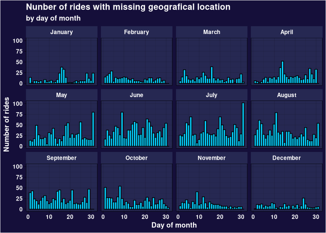

# Divvy case study


# Introduction

In this case study we take a look at the dataset provided by Divvy, a
company that is in the bussiness of bycicle rent. We will try to find
useful insights about diiferences between members and casual users of
the service that the marketing team could use find useful to develop
better marketing campaings to persuade casual user to become members of
the service. In order to do this we will focus on the next questions:

- What are the problems the dataset presents? Is there any way to
  overcome or mitigate those problems?
- Are there any clear distinction between members and casual users of
  the service that could be helpful?
- What suggestions could be made to the marketing team?

With those goals setted, we can start our analisys of the data.

# Setting up packages

First, we will setup all the R packages that we will use.

``` r
library(tidyverse)
```

    -- Attaching core tidyverse packages ------------------------ tidyverse 2.0.0 --
    v dplyr     1.1.4     v readr     2.1.5
    v forcats   1.0.0     v stringr   1.5.1
    v ggplot2   3.5.1     v tibble    3.2.1
    v lubridate 1.9.3     v tidyr     1.3.1
    v purrr     1.0.2     
    -- Conflicts ------------------------------------------ tidyverse_conflicts() --
    x dplyr::filter() masks stats::filter()
    x dplyr::lag()    masks stats::lag()
    i Use the conflicted package (<http://conflicted.r-lib.org/>) to force all conflicts to become errors

``` r
library(mapview)
library(lubridate)
library(sf)
```

    Linking to GEOS 3.13.0, GDAL 3.9.3, PROJ 9.5.0; sf_use_s2() is TRUE

``` r
library(jsonlite)
```


    Attaching package: 'jsonlite'

    The following object is masked from 'package:purrr':

        flatten

``` r
library(geosphere)
library(furrr)
```

    Loading required package: future

Loading data from source, if not it is available locally.

``` r
dates <- list("202310", "202311", "202312", "202401", "202402", "202403", "202404", "202405", "202406", "202407", "202408", "202409")
df <- tibble()
for (date in dates) {
  file <- sprintf("%s-divvy-tripdata.zip", date)
  if (!file.exists(file)) {
    link <- sprintf("https://divvy-tripdata.s3.amazonaws.com/%s", file)
    download.file(link, file)
  }
  df <- df |> bind_rows(read_csv(file, show_col_types = FALSE))
}
```

    Multiple files in zip: reading '202310-divvy-tripdata.csv'
    Multiple files in zip: reading '202311-divvy-tripdata.csv'
    Multiple files in zip: reading '202312-divvy-tripdata.csv'
    Multiple files in zip: reading '202401-divvy-tripdata.csv'
    Multiple files in zip: reading '202402-divvy-tripdata.csv'
    Multiple files in zip: reading '202403-divvy-tripdata.csv'
    Multiple files in zip: reading '202404-divvy-tripdata.csv'
    Multiple files in zip: reading '202405-divvy-tripdata.csv'
    Multiple files in zip: reading '202406-divvy-tripdata.csv'
    Multiple files in zip: reading '202407-divvy-tripdata.csv'
    Multiple files in zip: reading '202408-divvy-tripdata.csv'
    Multiple files in zip: reading '202409-divvy-tripdata.csv'

# Exploratory face

Read file as a tibble and first look at data.

``` r
head(df)
```

    # A tibble: 6 x 13
      ride_id          rideable_type started_at          ended_at           
      <chr>            <chr>         <dttm>              <dttm>             
    1 4449097279F8BBE7 classic_bike  2023-10-08 10:36:26 2023-10-08 10:49:19
    2 9CF060543CA7B439 electric_bike 2023-10-11 17:23:59 2023-10-11 17:36:08
    3 667F21F4D6BDE69C electric_bike 2023-10-12 07:02:33 2023-10-12 07:06:53
    4 F92714CC6B019B96 classic_bike  2023-10-24 19:13:03 2023-10-24 19:18:29
    5 5E34BA5DE945A9CC classic_bike  2023-10-09 18:19:26 2023-10-09 18:30:56
    6 F7D7420AFAC53CD9 electric_bike 2023-10-04 17:10:59 2023-10-04 17:25:21
    # i 9 more variables: start_station_name <chr>, start_station_id <chr>,
    #   end_station_name <chr>, end_station_id <chr>, start_lat <dbl>,
    #   start_lng <dbl>, end_lat <dbl>, end_lng <dbl>, member_casual <chr>

``` r
summary(df)
```

       ride_id          rideable_type        started_at                    
     Length:5854544     Length:5854544     Min.   :2023-10-01 00:00:05.00  
     Class :character   Class :character   1st Qu.:2024-02-27 05:34:06.75  
     Mode  :character   Mode  :character   Median :2024-06-06 12:55:34.65  
                                           Mean   :2024-05-08 12:56:33.76  
                                           3rd Qu.:2024-08-05 11:12:35.00  
                                           Max.   :2024-09-30 23:54:05.54  
                                                                           
        ended_at                      start_station_name start_station_id  
     Min.   :2023-10-01 00:02:02.00   Length:5854544     Length:5854544    
     1st Qu.:2024-02-27 05:50:02.00   Class :character   Class :character  
     Median :2024-06-06 13:17:11.44   Mode  :character   Mode  :character  
     Mean   :2024-05-08 13:13:52.17                                        
     3rd Qu.:2024-08-05 11:35:24.94                                        
     Max.   :2024-09-30 23:59:52.55                                        
                                                                           
     end_station_name   end_station_id       start_lat       start_lng     
     Length:5854544     Length:5854544     Min.   :41.64   Min.   :-87.94  
     Class :character   Class :character   1st Qu.:41.88   1st Qu.:-87.66  
     Mode  :character   Mode  :character   Median :41.90   Median :-87.64  
                                           Mean   :41.90   Mean   :-87.65  
                                           3rd Qu.:41.93   3rd Qu.:-87.63  
                                           Max.   :42.07   Max.   :-87.52  
                                                                           
        end_lat         end_lng        member_casual     
     Min.   :16.06   Min.   :-144.05   Length:5854544    
     1st Qu.:41.88   1st Qu.: -87.66   Class :character  
     Median :41.90   Median : -87.64   Mode  :character  
     Mean   :41.90   Mean   : -87.65                     
     3rd Qu.:41.93   3rd Qu.: -87.63                     
     Max.   :87.96   Max.   :   1.72                     
     NA's   :7441    NA's   :7441                        

``` r
dim(df)
```

    [1] 5854544      13

``` r
df |>
  select(ride_id) |>
  unique() |>
  dim()
```

    [1] 5854333       1

``` r
colSums(is.na(df))
```

               ride_id      rideable_type         started_at           ended_at 
                     0                  0                  0                  0 
    start_station_name   start_station_id   end_station_name     end_station_id 
               1056535            1056535            1091792            1091792 
             start_lat          start_lng            end_lat            end_lng 
                     0                  0               7441               7441 
         member_casual 
                     0 

# Data cleaning

The dataset has colums with 18% of their content missing. Since those
colums are the name or the id of the stations, we can try to obtain that
information from other sources. Also, there are some rows that does not
have their geografical info on where the ride ended, let’s have a look
at those.

One may suspect that the rides that have missing end latitude and
longitude would be at the end of the month, thinking of this cut on the
dataset publishing as the main source of missing information. Let’s
check a graph that could sustent this hipothesys

``` r
global_theme <-  function() {
  theme_linedraw() +
  theme(axis.text.y = element_blank(),
    axis.text.x = element_text(colour = 'white', face = 'bold'),
    axis.title.y = element_text(colour ='white', face = 'bold'), 
    axis.title.x = element_text(colour ='white', face = 'bold'),
    plot.title = element_text(colour = 'white', face = 'bold'),
    plot.subtitle = element_text(colour = 'white', face = 'bold'),
    strip.background = element_rect(fill = "#262852", color='#262852'),
    strip.placement = "inside",
    strip.text = element_text(colour = "white", face = 'bold'), 
    panel.background = element_rect(fill = "#262852"), 
    plot.background = element_rect(fill = "#150F3A"))
}

df |>
  filter(is.na(end_lng)) |>
  ggplot() +
  aes(x = mday(started_at)) +
  geom_histogram(bins = 31, color = "#07D0FF", fill = "#06CEFD") +
  global_theme() +
  facet_wrap(vars(month(started_at, label = TRUE, abbr = FALSE))) +
  labs(x = "Day of month", y = "Number of rides", title = "Nunber of rides with missing geografical location", subtitle = "by day of month")
```



We can’t see anything that suggest anything conclusive. Since we can’t
confidently recover the data lost, we sould drop those entries.

``` r
df <- filter(df, !is.na(end_lng))
colSums(is.na(df))
```

               ride_id      rideable_type         started_at           ended_at 
                     0                  0                  0                  0 
    start_station_name   start_station_id   end_station_name     end_station_id 
               1056535            1056535            1084351            1084351 
             start_lat          start_lng            end_lat            end_lng 
                     0                  0                  0                  0 
         member_casual 
                     0 

The other data that is missing is naming and id info from the stations.
Reading how the company operates, if you leave a divvy in any other
place that is not a station, you will be charged a fee, we can consider
this the cause for those missing entries. This will be used as another
parameter in our analisys.

Looking back to the data summary at the beginning, we can see that some
coordinates are very far away from the range, lets have some deeper look
at the stations info

``` r
df |>
  select(start_station_id) |>
  unique() |>
  dim()
```

    [1] 1701    1

``` r
df |>
  select(end_station_id) |>
  unique() |>
  dim()
```

    [1] 1711    1

``` r
df |>
  select(start_station_id, start_lat, start_lng) |>
  unique() |>
  dim()
```

    [1] 1342701       3

We can deduce that this dataset has multiple coordinates for some
stations. This may be due to how the coordinates and stations are added
to the database, maybe the coordinates are given by the bycicle, and if
the lock is activated in a station the name of the station is added to
the formulary before it is uploaded.

This might be a problem, since we detected that there are some
coordinates that are very far away from the city where Divvy is working,
and we may want to use the location of the stations to look for some
trends. Let’s find the worst cases of this problematic.

``` r
#TODO
```

Looking at the page from divvy, we could obtain the exact location of
the stations, let’s incorporate that

``` r
stations_json <- "stations.json"
if (!file.exists(stations_json)) {
  download.file("https://gbfs.lyft.com/gbfs/2.3/chi/en/station_information.json", stations_json)
}
stations <- fromJSON(stations_json) |>
  _$data$stations |>
  as_tibble() |>
  select(station_id, short_name, name, lon, lat)

stations |>
  distinct(station_id)|>
  dim()
```

    [1] 1801    1

``` r
stations |>
  distinct(lat, lon) |>
  dim()
```

    [1] 1798    2

``` r
stations |>
  group_by(lat, lon) |>
  filter(n() > 1) |>
  ungroup() 
```

    # A tibble: 6 x 5
      station_id                           short_name   name               lon   lat
      <chr>                                <chr>        <chr>            <dbl> <dbl>
    1 a3a3a282-a135-11e9-9cda-0a87ae2ba916 TA1306000014 "Wilton Ave & D~ -87.7  41.9
    2 d53ae727-5265-4b8e-a6ca-2a36dc0345c4 chargingstx2 "Wilton Ave & D~ -87.7  41.9
    3 1827484051430132402                  <NA>         "Public Rack - ~ -87.8  42.0
    4 1677249871073777806                  <NA>         "Public Rack - ~ -87.7  41.8
    5 1715823821144840768                  <NA>         "Public Rack - ~ -87.7  41.8
    6 1827474404723843690                  <NA>         "Public Rack - ~ -87.8  42.0

``` r
stations |>
  group_by(name) |>
  filter(n() > 1) |>
  ungroup()
```

    # A tibble: 6 x 5
      station_id          short_name name                     lon   lat
      <chr>               <chr>      <chr>                  <dbl> <dbl>
    1 1967727360320698512 24211      Western Ave & Lake St  -87.7  41.9
    2 1978857650118994914 24409      Indiana Ave & 133rd St -87.6  41.7
    3 1984042930424753006 24394      Steelworkers Park      -87.5  41.7
    4 1448642188027369090 <NA>       Steelworkers Park      -87.5  41.7
    5 1594046379513303720 <NA>       Western Ave & Lake St  -87.7  41.9
    6 1448642188027369086 <NA>       Indiana Ave & 133rd St -87.6  41.7

This data is mostly clean, just some typos in the system that are an
easy fix. Since I can count those errors with one hand, I manually check
them on Google Maps. Here are my findings:

- Wilton Ave & Diversey Pkwy has many places to park, maybe the company
  takes those as 2 different stations
- Forest Glen station and Peterson Park are 2 stations that are just a
  meter or 2 of distance, we can consider both as one station
- Laflin St & 51st St appears to be a typo, since there is just one
  station nerby.

We will proceed as follows

``` r
stations |>
  filter(station_id=='a3a3a282-a135-11e9-9cda-0a87ae2ba916' | station_id=='')
```

    # A tibble: 1 x 5
      station_id                           short_name   name               lon   lat
      <chr>                                <chr>        <chr>            <dbl> <dbl>
    1 a3a3a282-a135-11e9-9cda-0a87ae2ba916 TA1306000014 Wilton Ave & Di~ -87.7  41.9

Awesome, now we have a clean dataset of the stations info

``` r
distm_v <- Vectorize(function(x1, y1, x2, y2) {
  distm(c(x1, y1), c(x2, y2), fun = distHaversine)
})

assert.value <- function(value) {
  if (dim(value)[1] == 0) {
    tibble(station_id = "")
  } else {
    value
  }
}

closestStationMargin <- function(margin) {
  function(latitude, longitude) {
    station.closest <- stations |>
      select(lat, lon, station_id, distance) |>
      filter(lat < latitude + margin & lat > latitude - margin & lon < longitude + margin & lon > longitude - margin) |>
      mutate(distance = distm_v(longitude, latitude, lon, lat)) |>
      slice_min(distance, n = 1, with_ties = FALSE) |>
      assert.value() |>
      _$station_id
  }
}

stations.geoinfo <- select(df, start_lat, start_lng) |>
  rename(lat = start_lat, lng = start_lng) |>
  bind_rows(select(df, end_lat, end_lng) |>
    rename(lat = end_lat, lng = end_lng)) |>
  unique()

stationsGetClosest <- closestStationMargin(0.001)

plan(multicore, workers = 3)
stations.with.id <- if (file.exists("coords_with_names.csv")) {
  read_csv("coords_with_names.csv")
} else {
  stations.geoinfo |>
    rename(latitude = lat, longitude = lng) |>
    slice_sample(n = 50000) |>
    mutate(station_id = future_map2_chr(latitude, longitude, stationsGetClosest))
}
```

    Rows: 1343123 Columns: 3
    -- Column specification --------------------------------------------------------
    Delimiter: ","
    chr (1): station_id
    dbl (2): latitude, longitude

    i Use `spec()` to retrieve the full column specification for this data.
    i Specify the column types or set `show_col_types = FALSE` to quiet this message.

# Data cleaning

``` r
# graoh <- ggplot(data = df) +
#  aes(x = member_casual, fill = rideable_type) +
#  geom_bar()
#
# distm_v   <-  Vectorize(function(x1,y1,x2,y2) {
#  distm(c(x1, y1), c(x2, y2), fun = distHaversine)
# }
# )
#
# data  <- df |>
#  mutate(distance = distm_v(end_lng, end_lat, start_lng, end_lat), time = as.integer(ended_at - started_at)) |>
#  mutate(avg_velocity = distance/ time) |>
#  select(ride_id, start_station_id, started_at, time, distance, member_casual, rideable_type, start_lng, start_lat, avg_velocity)
#
# visual  <- data |>
#  select(member_casual, avg_velocity, distance, time) |>
#  group_by(member_casual) |>
#  summarise(avg_time_used = mean(time), avg_distance = mean(distance), count = n())
#
# p  <- ggplot(data = visual) + aes(x = member_casual, y= avg_time_used) + geom_col()
#
# p1  <- ggplot(data = visual) + aes(x = member_casual, y= avg_distance) + geom_col()
#
# p2  <- ggplot(data = visual) + aes(x = member_casual, y= count) + geom_col()
#
# p
# p1
# p2
#
# ggplot(data=data) + aes(x = distance) + geom_histogram(bins=60) + facet_grid(vars(member_casual))
# per_hour_day  <- ggplot(data=data) + aes(x = hour(started_at)) + geom_histogram(bins = 24, fill = 'lightblue', color = 'darkblue') + facet_grid(cols=vars(member_casual), rows=vars(wday(started_at, week_start = 1, label = TRUE, abbr = FALSE))) + labs(title = 'Rides per hour of day', subtitle='Data from Agust 2024', x='Hour',y='Number of rides')+  theme_linedraw()
# per_day <-  ggplot(data=data) + aes(x = wday(started_at, week_start = 1), fill = rideable_type) + geom_histogram() + facet_grid(cols=vars(member_casual), rows =vars(week(started_at))) + labs(x='day of the week', title = 'Rides per day of the week', subtitle = 'Data from Agust, 2024', y = 'Number of rides') + theme_linedraw()
# ggplot(data=filter(data, time < 3000)) + aes(x=hms::as_hms(started_at), y=time, colour=rideable_type) + geom_point() + facet_grid(rows=vars(wday(started_at)), cols=vars(member_casual))
# per_day
# per_hour_day
#
# data |>
#  select(started_at, time) |>
#  mutate(hour = hour(started_at), day  )
#
# ggplot() + aes(x=distance, y=time, colour=rideable_type  )+ geom_point()
# data |> slice_min(time)
# glimpse(data)
# map  <- data |>
#  group_by(start_station_id, start_lng, start_lat, member_casual, rideable_type) |>
#  summarise(avg_dist = mean(distance), avg_time = mean (time), rides = n(), avg_vel = mean(avg_velocity), .groups = "keep")
#
# pos  <- map |>
#  arrange(desc(avg_dist))
#
#
# loc_sf  <- st_as_sf(map, coords = c('start_lng', 'start_lat'))
# st_crs(loc_sf) = 4236
#
# mapview(loc_sf, zcol='rides')
# mapview(loc_sf, zcol='avg_dist')
#
#
```
