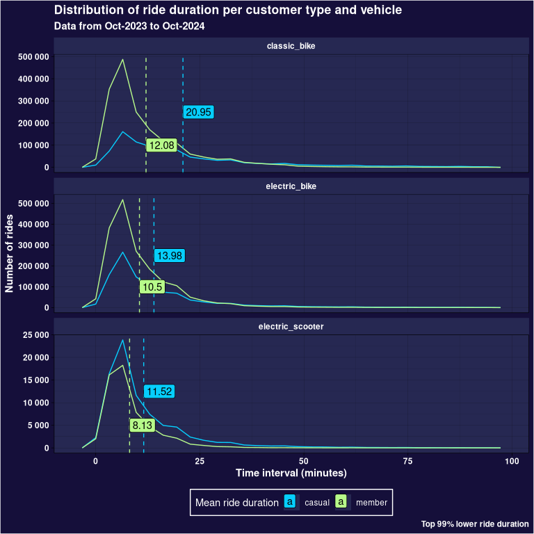

# Divvy case study


# Introduction

In this case study we take a look at the dataset provided by Divvy, a
company that is in the business of bicycle rent. We will try to find
useful insights about differences between members and casual users of
the service that the marketing team could use find useful to develop
better marketing campaigns to persuade casual user to become members of
the service. In order to do this we will focus on the next questions:

- What are the problems the dataset presents? Is there any way to
  overcome or mitigate those problems?
- Are there any clear distinction between members and casual users of
  the service that could be helpful?
- What suggestions could be made to the marketing team?

With those goals settled, we can start our analysis of the data.

# Setting up packages

First, we will setup all the R packages that we will use.

``` r
library(tidyverse)
library(knitr)
library(mapview)
library(lubridate)
library(sf)
library(jsonlite)
library(geosphere)
library(furrr)
```

Loading data from source, if not it is available locally.

``` r
dates <- list("202310", "202311", "202312", "202401", "202402", "202403", "202404", "202405", "202406", "202407", "202408", "202409")
df <- tibble()
for (date in dates) {
  file <- sprintf("%s-divvy-tripdata.zip", date)
  if (!file.exists(file)) {
    link <- sprintf("https://divvy-tripdata.s3.amazonaws.com/%s", file)
    download.file(link, file)
  }
  df <- df |> bind_rows(read_csv(file, show_col_types = FALSE))
}
```

# Exploratory face

Read file as a tibble and first look at data.

``` r
opts <- options(knitr.kable.NA = "")

kable(head(df))
```

| ride_id          | rideable_type | started_at          | ended_at            | start_station_name                   | start_station_id | end_station_name            | end_station_id | start_lat | start_lng |  end_lat |   end_lng | member_casual |
|:-----------------|:--------------|:--------------------|:--------------------|:-------------------------------------|:-----------------|:----------------------------|:---------------|----------:|----------:|---------:|----------:|:--------------|
| 4449097279F8BBE7 | classic_bike  | 2023-10-08 10:36:26 | 2023-10-08 10:49:19 | Orleans St & Chestnut St (NEXT Apts) | 620              | Sheffield Ave & Webster Ave | TA1309000033   |  41.89820 | -87.63754 | 41.92154 | -87.65382 | member        |
| 9CF060543CA7B439 | electric_bike | 2023-10-11 17:23:59 | 2023-10-11 17:36:08 | Desplaines St & Kinzie St            | TA1306000003     | Sheffield Ave & Webster Ave | TA1309000033   |  41.88864 | -87.64441 | 41.92154 | -87.65382 | member        |
| 667F21F4D6BDE69C | electric_bike | 2023-10-12 07:02:33 | 2023-10-12 07:06:53 | Orleans St & Chestnut St (NEXT Apts) | 620              | Franklin St & Lake St       | TA1307000111   |  41.89807 | -87.63751 | 41.88584 | -87.63550 | member        |
| F92714CC6B019B96 | classic_bike  | 2023-10-24 19:13:03 | 2023-10-24 19:18:29 | Desplaines St & Kinzie St            | TA1306000003     | Franklin St & Lake St       | TA1307000111   |  41.88872 | -87.64445 | 41.88584 | -87.63550 | member        |
| 5E34BA5DE945A9CC | classic_bike  | 2023-10-09 18:19:26 | 2023-10-09 18:30:56 | Desplaines St & Kinzie St            | TA1306000003     | Franklin St & Lake St       | TA1307000111   |  41.88872 | -87.64445 | 41.88584 | -87.63550 | member        |
| F7D7420AFAC53CD9 | electric_bike | 2023-10-04 17:10:59 | 2023-10-04 17:25:21 | Orleans St & Chestnut St (NEXT Apts) | 620              | Sheffield Ave & Webster Ave | TA1309000033   |  41.89812 | -87.63753 | 41.92154 | -87.65382 | member        |

``` r
kable(summary(df))
```

|     | ride_id          | rideable_type    | started_at                     | ended_at                       | start_station_name | start_station_id | end_station_name | end_station_id   | start_lat     | start_lng      | end_lat       | end_lng         | member_casual    |
|:----|:-----------------|:-----------------|:-------------------------------|:-------------------------------|:-------------------|:-----------------|:-----------------|:-----------------|:--------------|:---------------|:--------------|:----------------|:-----------------|
|     | Length:5854544   | Length:5854544   | Min. :2023-10-01 00:00:05.00   | Min. :2023-10-01 00:02:02.00   | Length:5854544     | Length:5854544   | Length:5854544   | Length:5854544   | Min. :41.64   | Min. :-87.94   | Min. :16.06   | Min. :-144.05   | Length:5854544   |
|     | Class :character | Class :character | 1st Qu.:2024-02-27 05:34:06.75 | 1st Qu.:2024-02-27 05:50:02.00 | Class :character   | Class :character | Class :character | Class :character | 1st Qu.:41.88 | 1st Qu.:-87.66 | 1st Qu.:41.88 | 1st Qu.: -87.66 | Class :character |
|     | Mode :character  | Mode :character  | Median :2024-06-06 12:55:34.65 | Median :2024-06-06 13:17:11.44 | Mode :character    | Mode :character  | Mode :character  | Mode :character  | Median :41.90 | Median :-87.64 | Median :41.90 | Median : -87.64 | Mode :character  |
|     |                  |                  | Mean :2024-05-08 12:56:33.76   | Mean :2024-05-08 13:13:52.17   |                    |                  |                  |                  | Mean :41.90   | Mean :-87.65   | Mean :41.90   | Mean : -87.65   |                  |
|     |                  |                  | 3rd Qu.:2024-08-05 11:12:35.00 | 3rd Qu.:2024-08-05 11:35:24.94 |                    |                  |                  |                  | 3rd Qu.:41.93 | 3rd Qu.:-87.63 | 3rd Qu.:41.93 | 3rd Qu.: -87.63 |                  |
|     |                  |                  | Max. :2024-09-30 23:54:05.54   | Max. :2024-09-30 23:59:52.55   |                    |                  |                  |                  | Max. :42.07   | Max. :-87.52   | Max. :87.96   | Max. : 1.72     |                  |
|     |                  |                  |                                |                                |                    |                  |                  |                  |               |                | NA’s :7441    | NA’s :7441      |                  |

``` r
df |>
  dim() |>
  kable(col.names = c("Dimension"))
```

| Dimension |
|----------:|
|   5854544 |
|        13 |

``` r
df |>
  select(ride_id) |>
  unique() |>
  dim() |>
  kable(col.names = c("Dimensions"))
```

| Dimensions |
|-----------:|
|    5854333 |
|          1 |

``` r
df |>
  is.na() |>
  colSums() |>
  kable(col.names = c("Column", "NA's"))
```

| Column             |    NA’s |
|:-------------------|--------:|
| ride_id            |       0 |
| rideable_type      |       0 |
| started_at         |       0 |
| ended_at           |       0 |
| start_station_name | 1056535 |
| start_station_id   | 1056535 |
| end_station_name   | 1091792 |
| end_station_id     | 1091792 |
| start_lat          |       0 |
| start_lng          |       0 |
| end_lat            |    7441 |
| end_lng            |    7441 |
| member_casual      |       0 |

# Data cleaning

The dataset has columns with 18% of their content missing. Since those
columns are the name or the id of the stations, we can try to obtain
that information from other sources. Also, there are some rows that does
not have their geographical info on where the ride ended, let’s have a
look at those.

One may suspect that the rides that have missing end latitude and
longitude would be at the end of the month, thinking of this cut on the
dataset publishing as the main source of missing information. Let’s
check a graph that could sustain this hypothesis

``` r
df |>
  filter(is.na(end_lng)) |>
  ggplot() +
  aes(x = mday(started_at)) +
  geom_histogram(binwidth = 1, color = "#000000", fill = "#06CEFD") +
  global_theme() +
  facet_wrap(vars(month(started_at, label = TRUE, abbr = FALSE))) +
  labs(
    x = "Day of month",
    y = "Number of rides",
    title = "Nunber of rides with missing geografical location",
    subtitle = "by day of month"
  )
```


We can’t see anything that suggest anything conclusive. Since we can’t
confidently recover the data lost, we should drop those entries.

``` r
df <- filter(df, !is.na(end_lng))

df |>
  is.na() |>
  colSums() |>
  kable(col.names = c("Column", "NA's"))
```

| Column             |    NA’s |
|:-------------------|--------:|
| ride_id            |       0 |
| rideable_type      |       0 |
| started_at         |       0 |
| ended_at           |       0 |
| start_station_name | 1056535 |
| start_station_id   | 1056535 |
| end_station_name   | 1084351 |
| end_station_id     | 1084351 |
| start_lat          |       0 |
| start_lng          |       0 |
| end_lat            |       0 |
| end_lng            |       0 |
| member_casual      |       0 |

The other data that is missing is naming and id info from the stations.
Reading how the company operates, if you leave a divvy in any other
place that is not a station, you will be charged a fee, we can consider
this the cause for those missing entries. This will be used as another
parameter in our analysis.

Looking back to the data summary at the beginning, we can see that some
coordinates are very far away from the range, let’s have some deeper
look at the stations info

``` r
df |>
  select(start_station_id) |>
  unique() |>
  dim() |>
  kable(col.names = c("Dimension"))
```

| Dimension |
|----------:|
|      1701 |
|         1 |

``` r
df |>
  select(end_station_id) |>
  unique() |>
  dim() |>
  kable(col.names = c("Dimension"))
```

| Dimension |
|----------:|
|      1711 |
|         1 |

``` r
df |>
  select(start_station_id, start_lat, start_lng) |>
  unique() |>
  dim() |>
  kable(col.names = c("Dimension"))
```

| Dimension |
|----------:|
|   1342701 |
|         3 |

We can deduce that this dataset has multiple coordinates for some
stations. This might be due to how the coordinates and stations are
added to the database. I think that the coordinates are given by the
bicycle, and if the lock is activated in a station the name of the
station is added to the form before it is uploaded. This might be a
problem, since we detected that there are some coordinates that are very
far away from the city where Divvy is working. We may want to use the
location of the stations to look for some trends. Let’s find an example
of this problematic.

``` r
distm_v <- Vectorize(function(x1, y1, x2, y2) {
  distm(c(x1, y1), c(x2, y2), fun = distHaversine)
})

df |>
  select(start_station_id, start_station_name, start_lng, start_lat) |>
  filter(start_station_id == 13029) |>
  mutate(
    mean_lng = mean(start_lng), mean_lat = mean(start_lat), most_distant =
      distm_v(mean_lat, mean_lng, start_lat, start_lng)
  ) |>
  filter(most_distant > 15) |>
  ggplot() +
  aes(x = most_distant) +
  scale_x_log10() +
  global_theme() +
  geom_histogram(bins = 100, color = "#000000", fill = "#06CEFD") +
  labs(
    x = "Distance (meters) to mean",
    y = "Number of rides",
    title = "Distribution of distance to mean of start coordinates",
    subtitle = 'Station "Station Flied Museum"',
    caption = "(only rides with distance > 15m)"
  )
```


This graph shows that the coordinates present in our data are
unreliable. Thus we need to look for another data source for information
about coordinates of stations.

Looking at the data page from divvy, there is a link for a json with
information about location of stations, let’s incorporate it.

``` r
stations_json <- "stations.json"
if (!file.exists(stations_json)) {
  download.file(
    "https://gbfs.lyft.com/gbfs/2.3/chi/en/station_information.json",
    stations_json
  )
}

stations <- fromJSON(stations_json) |>
  _$data$stations |>
  as_tibble()

stations |>
  head() |>
  select(!rental_uris) |>
  kable()
```

| station_id                           |      lat |       lon | name                         | capacity | short_name   | region_id | address |
|:-------------------------------------|---------:|----------:|:-----------------------------|---------:|:-------------|:----------|:--------|
| 1955905507044284968                  | 41.92227 | -87.80202 | Nordica Ave & Medill Ave     |       15 | 21378        | NA        | NA      |
| 1934289361049585738                  | 41.82810 | -87.69468 | California Ave & 36th St     |       15 | 21338        | NA        | NA      |
| a3b0fae6-a135-11e9-9cda-0a87ae2ba916 | 42.01270 | -87.66606 | Glenwood Ave & Touhy Ave     |       15 | 525          | NA        | NA      |
| a3ad4d1b-a135-11e9-9cda-0a87ae2ba916 | 41.81409 | -87.59701 | Woodlawn Ave & Lake Park Ave |       15 | KA1503000065 | NA        | NA      |
| a3acdae2-a135-11e9-9cda-0a87ae2ba916 | 41.78008 | -87.62975 | Wentworth Ave & 63rd St      |       11 | KA1503000025 | NA        | NA      |
| a3a9f76a-a135-11e9-9cda-0a87ae2ba916 | 41.92153 | -87.70732 | Kedzie Ave & Palmer Ct       |       15 | 13292        | NA        | NA      |

``` r
stations |>
  is.na() |>
  colSums() |>
  kable(col.names = c("Value", "NA's"))
```

| Value      | NA’s |
|:-----------|-----:|
| station_id |    0 |
| lat        |    0 |
| lon        |    0 |
| name       |    0 |
| capacity   |    0 |
| ios        |    0 |
| android    |    0 |
| short_name |  872 |
| region_id  | 1787 |
| address    |  929 |

``` r
stations <- stations |>
  select(station_id, short_name, name, lon, lat)

stations |>
  distinct(station_id) |>
  dim() |>
  kable(col.names = c("Dimension"))
```

| Dimension |
|----------:|
|      1801 |
|         1 |

``` r
stations |>
  distinct(lat, lon) |>
  dim() |>
  kable(col.names = c("Dimension"))
```

| Dimension |
|----------:|
|      1798 |
|         2 |

``` r
stations |>
  group_by(station_id) |>
  filter(n() > 1) |>
  ungroup() |>
  kable(caption = "Stations with repeated id")
```

| station_id | short_name | name | lon | lat |
|:-----------|:-----------|:-----|----:|----:|

Stations with repeated id

``` r
stations |>
  group_by(lat, lon) |>
  filter(n() > 1) |>
  ungroup() |>
  kable(caption = "Stations with repeated coordinates")
```

| station_id                           | short_name   | name                              |       lon |      lat |
|:-------------------------------------|:-------------|:----------------------------------|----------:|---------:|
| a3a3a282-a135-11e9-9cda-0a87ae2ba916 | TA1306000014 | Wilton Ave & Diversey Pkwy        | -87.65270 | 41.93242 |
| d53ae727-5265-4b8e-a6ca-2a36dc0345c4 | chargingstx2 | Wilton Ave & Diversey Pkwy\*      | -87.65270 | 41.93242 |
| 1827484051430132402                  | NA           | Public Rack - Forest Glen Station | -87.75552 | 41.97871 |
| 1715823821144840768                  | NA           | Public Rack - Laflin St &51st ST  | -87.66208 | 41.80135 |
| 1677249871073777806                  | NA           | Public Rack - Laflin St & 51st St | -87.66208 | 41.80135 |
| 1827474404723843690                  | NA           | Public Rack - Peterson Park       | -87.75552 | 41.97871 |

Stations with repeated coordinates

``` r
stations |>
  group_by(name) |>
  filter(n() > 1) |>
  ungroup() |>
  kable(caption = "Stations with repeated name")
```

| station_id          | short_name | name                   |       lon |      lat |
|:--------------------|:-----------|:-----------------------|----------:|---------:|
| 1978857650118994914 | 24409      | Indiana Ave & 133rd St | -87.61719 | 41.65380 |
| 1967727360320698512 | 24211      | Western Ave & Lake St  | -87.68668 | 41.88481 |
| 1984042930424753006 | 24394      | Steelworkers Park      | -87.53091 | 41.73793 |
| 1448642188027369086 | NA         | Indiana Ave & 133rd St | -87.61705 | 41.65356 |
| 1594046379513303720 | NA         | Western Ave & Lake St  | -87.68585 | 41.88461 |
| 1448642188027369090 | NA         | Steelworkers Park      | -87.53107 | 41.73825 |

Stations with repeated name

This data is mostly clean, just some typos in the system that are an
easy fix. Since I can count those errors with one hand, I manually check
them on Google Maps. Here are my findings:

1)  Wilton Ave & Diversey Pkwy has many places to park, maybe the
    company takes those as 2 different stations, we can merge them.
2)  Forest Glen station and Peterson Park are 2 stations that are just a
    meter or 2 of distance, we can consider both as one station.
3)  Laflin St & 51st St appears to be a typo, since there is just one
    station nearby. We will convert those 2 stations into one.
4)  For those stations that share name but not coordinates, I’ve found
    that they are just stations that are very close to each other.
    Luckily, they have a different station id, and more over, only 1 of
    each pair have shortname, which is the column used as station id in
    our original dataframe.

Let’s implement those solutions:

``` r
stations <- stations |>
  filter(station_id != "1448642188027369090") |>
  filter(station_id != "1594046379513303720") |>
  filter(station_id != "1448642188027369086")
# NOTE: WTF!!! If we connect those statements with the | operator, with multiple
# lines, it doesn't work

df <- df |>
  select(ride_id:start_station_name, end_station_name, member_casual) |>
  left_join(stations, by = join_by(start_station_name == name)) |>
  mutate(start_station_id = station_id, start_lon = lon, start_lat = lat) |>
  select(!station_id:lat) |>
  left_join(stations, by = join_by(end_station_name == name)) |>
  mutate(end_station_id = station_id, end_lon = lon, end_lat = lat) |>
  select(!station_id:lat) |>
  mutate(
    start_station_id = if_else(
      start_station_id == "d53ae727-5265-4b8e-a6ca-2a36dc0345c4",
      "a3a3a282-a135-11e9-9cda-0a87ae2ba916",
      start_station_id
    ),
    start_station_name = if_else(
      start_station_name == "Wilton Ave & Diversey Pkwy*",
      "Wilton Ave & Diversey Pkwy", start_station_name
    ),
    end_station_id = if_else(
      end_station_id == "d53ae727-5265-4b8e-a6ca-2a36dc0345c4",
      "a3a3a282-a135-11e9-9cda-0a87ae2ba916", end_station_id
    ),
    end_station_name = if_else(
      end_station_name == "Wilton Ave & Diversey Pkwy*",
      "Wilton Ave & Diversey Pkwy", end_station_name
    )
  ) |>
  mutate(
    start_station_id = if_else(
      start_station_id == "1715823821144840768",
      "1677249871073777806",
      start_station_id
    ),
    start_station_name = if_else(
      start_station_name == "Public Rack - Laflin St & 51st ST",
      "Public Rack - Laflin St & 51st St", start_station_name
    ),
    end_station_id = if_else(
      end_station_id == "1715823821144840768",
      "1677249871073777806", end_station_id
    ),
    end_station_name = if_else(
      end_station_name == "Public Rack - Laflin St & 51st ST",
      "Public Rack - Laflin St & 51st St", end_station_name
    )
  ) |>
  mutate(
    start_station_id = if_else(
      start_station_id == "1827484051430132402",
      "1827474404723843690",
      start_station_id
    ),
    start_station_name = if_else(
      start_station_name == "Public Rack - Forest Glen Station",
      "Public Rack - Peterson Park", start_station_name
    ),
    end_station_id = if_else(
      end_station_id == "1827484051430132402",
      "1827474404723843690", end_station_id
    ),
    end_station_name = if_else(
      end_station_name == "Public Rack - Forest Glen Station",
      "Public Rack - Peterson Park", end_station_name
    )
  ) |>
  mutate(ride_duration = as.integer(ended_at - started_at))

df |>
  head() |>
  kable()
```

| ride_id          | rideable_type | started_at          | ended_at            | start_station_name                   | end_station_name            | member_casual | start_station_id                     | start_lon | start_lat | end_station_id                       |   end_lon |  end_lat | ride_duration |
|:-----------------|:--------------|:--------------------|:--------------------|:-------------------------------------|:----------------------------|:--------------|:-------------------------------------|----------:|----------:|:-------------------------------------|----------:|---------:|--------------:|
| 4449097279F8BBE7 | classic_bike  | 2023-10-08 10:36:26 | 2023-10-08 10:49:19 | Orleans St & Chestnut St (NEXT Apts) | Sheffield Ave & Webster Ave | member        | a3b35e21-a135-11e9-9cda-0a87ae2ba916 | -87.63754 |  41.89820 | a3aabad8-a135-11e9-9cda-0a87ae2ba916 | -87.65382 | 41.92154 |           773 |
| 9CF060543CA7B439 | electric_bike | 2023-10-11 17:23:59 | 2023-10-11 17:36:08 | Desplaines St & Kinzie St            | Sheffield Ave & Webster Ave | member        | a3a482fb-a135-11e9-9cda-0a87ae2ba916 | -87.64445 |  41.88872 | a3aabad8-a135-11e9-9cda-0a87ae2ba916 | -87.65382 | 41.92154 |           729 |
| 667F21F4D6BDE69C | electric_bike | 2023-10-12 07:02:33 | 2023-10-12 07:06:53 | Orleans St & Chestnut St (NEXT Apts) | Franklin St & Lake St       | member        | a3b35e21-a135-11e9-9cda-0a87ae2ba916 | -87.63754 |  41.89820 | a3a6f7a5-a135-11e9-9cda-0a87ae2ba916 | -87.63550 | 41.88584 |           260 |
| F92714CC6B019B96 | classic_bike  | 2023-10-24 19:13:03 | 2023-10-24 19:18:29 | Desplaines St & Kinzie St            | Franklin St & Lake St       | member        | a3a482fb-a135-11e9-9cda-0a87ae2ba916 | -87.64445 |  41.88872 | a3a6f7a5-a135-11e9-9cda-0a87ae2ba916 | -87.63550 | 41.88584 |           326 |
| 5E34BA5DE945A9CC | classic_bike  | 2023-10-09 18:19:26 | 2023-10-09 18:30:56 | Desplaines St & Kinzie St            | Franklin St & Lake St       | member        | a3a482fb-a135-11e9-9cda-0a87ae2ba916 | -87.64445 |  41.88872 | a3a6f7a5-a135-11e9-9cda-0a87ae2ba916 | -87.63550 | 41.88584 |           690 |
| F7D7420AFAC53CD9 | electric_bike | 2023-10-04 17:10:59 | 2023-10-04 17:25:21 | Orleans St & Chestnut St (NEXT Apts) | Sheffield Ave & Webster Ave | member        | a3b35e21-a135-11e9-9cda-0a87ae2ba916 | -87.63754 |  41.89820 | a3aabad8-a135-11e9-9cda-0a87ae2ba916 | -87.65382 | 41.92154 |           862 |

``` r
kable(summary(df))
```

|     | ride_id          | rideable_type    | started_at                     | ended_at                       | start_station_name | end_station_name | member_casual    | start_station_id | start_lon     | start_lat     | end_station_id   | end_lon       | end_lat       | ride_duration |
|:----|:-----------------|:-----------------|:-------------------------------|:-------------------------------|:-------------------|:-----------------|:-----------------|:-----------------|:--------------|:--------------|:-----------------|:--------------|:--------------|:--------------|
|     | Length:5847103   | Length:5847103   | Min. :2023-10-01 00:00:05.00   | Min. :2023-10-01 00:02:02.00   | Length:5847103     | Length:5847103   | Length:5847103   | Length:5847103   | Min. :-87.8   | Min. :41.6    | Length:5847103   | Min. :-87.8   | Min. :41.6    | Min. :-999391 |
|     | Class :character | Class :character | 1st Qu.:2024-02-27 02:45:42.00 | 1st Qu.:2024-02-27 03:43:53.50 | Class :character   | Class :character | Class :character | Class :character | 1st Qu.:-87.7 | 1st Qu.:41.9  | Class :character | 1st Qu.:-87.7 | 1st Qu.:41.9  | 1st Qu.: 331  |
|     | Mode :character  | Mode :character  | Median :2024-06-06 12:51:30.67 | Median :2024-06-06 13:09:38.19 | Mode :character    | Mode :character  | Mode :character  | Mode :character  | Median :-87.6 | Median :41.9  | Mode :character  | Median :-87.6 | Median :41.9  | Median : 580  |
|     |                  |                  | Mean :2024-05-08 12:54:21.68   | Mean :2024-05-08 13:09:46.89   |                    |                  |                  |                  | Mean :-87.6   | Mean :41.9    |                  | Mean :-87.6   | Mean :41.9    | Mean : 925    |
|     |                  |                  | 3rd Qu.:2024-08-05 11:40:13.60 | 3rd Qu.:2024-08-05 11:57:43.35 |                    |                  |                  |                  | 3rd Qu.:-87.6 | 3rd Qu.:41.9  |                  | 3rd Qu.:-87.6 | 3rd Qu.:41.9  | 3rd Qu.: 1028 |
|     |                  |                  | Max. :2024-09-30 23:54:05.54   | Max. :2024-09-30 23:59:52.55   |                    |                  |                  |                  | Max. :-87.5   | Max. :42.1    |                  | Max. :-87.5   | Max. :42.1    | Max. : 90562  |
|     |                  |                  |                                |                                |                    |                  |                  |                  | NA’s :1071544 | NA’s :1071544 |                  | NA’s :1098661 | NA’s :1098661 |               |

We have now finished our data cleaning process. Now that our data is
ready, let’s continue with our analysis.

## Data analysis

``` r
df |>
 select(member_casual, ride_duration) |>
 group_by(member_casual) |>
 summarise(avg_ride_duration = mean(ride_duration), count = n()) |>
  ggplot() + aes(x=member_casual, y = avg_ride_duration) + geom_col(color = "#000000") + global_theme()
```


``` r
df |>
  filter(ride_duration < 0) |>
  ggplot() + aes(x = mday(started_at)) + geom_histogram(binwidth = 1, color = "#000000", fill = "#06CEFD") + global_theme() +
  facet_wrap(vars(month(started_at, label = TRUE, abbr = FALSE))) 
```



``` r
# p  <- ggplot(data = visual) + aes(x = member_casual, y= avg_time_used) + geom_col()
# assert_value <- function(value) {
#   if (dim(value)[1] == 0) {
#     tibble(station_id = "")
#   } else {
#     value
#   }
# }
#
# closest_station_margin <- function(margin) {
#   function(latitude, longitude) {
#     station_closest <- stations |>
#       select(lat, lon, station_id) |>
#       filter(
#         lat < latitude + margin &
#           lat > latitude - margin &
#           lon < longitude + margin &
#           lon > longitude - margin
#       ) |>
#       mutate(distance = distm_v(longitude, latitude, lon, lat)) |>
#       slice_min(distance, n = 1, with_ties = FALSE) |>
#       assert_value() |>
#       _$station_id
#   }
# }
#
# stations_geoinfo <- select(df, start_lat, start_lng) |>
#   rename(lat = start_lat, lng = start_lng) |>
#   bind_rows(select(df, end_lat, end_lng) |>
#     rename(lat = end_lat, lng = end_lng)) |>
#   unique()
#
# stations_get_closest <- closest_station_margin(0.001)
#
# plan(multicore, workers = 3)
# stations_with_id <- if (file.exists("coords_with_names.csv")) {
#   read_csv("coords_with_names.csv")
# } else {
#   stations.geoinfo |>
#     rename(latitude = lat, longitude = lng) |>
#     slice_sample(n = 50000) |>
#     mutate(
#       station_id = future_map2_chr(latitude, longitude, stations_get_closest)
#     )
# }
```

``` r
# graoh <- ggplot(data = df) +
#  aes(x = member_casual, fill = rideable_type) +
#  geom_bar()
#
# distm_v   <-  Vectorize(function(x1,y1,x2,y2) {
#  distm(c(x1, y1), c(x2, y2), fun = distHaversine)
# }
# )
#
# data  <- df |>
#  mutate(distance = distm_v(end_lng, end_lat, start_lng, end_lat), time = as.integer(ended_at - started_at)) |>
#  mutate(avg_velocity = distance/ time) |>
#  select(ride_id, start_station_id, started_at, time, distance, member_casual, rideable_type, start_lng, start_lat, avg_velocity)
#
# visual  <- data |>
#  select(member_casual, avg_velocity, distance, time) |>
#  group_by(member_casual) |>
#  summarise(avg_time_used = mean(time), avg_distance = mean(distance), count = n())
#
# p  <- ggplot(data = visual) + aes(x = member_casual, y= avg_time_used) + geom_col()
#
# p1  <- ggplot(data = visual) + aes(x = member_casual, y= avg_distance) + geom_col()
#
# p2  <- ggplot(data = visual) + aes(x = member_casual, y= count) + geom_col()
#
# p
# p1
# p2
#
# ggplot(data=data) + aes(x = distance) + geom_histogram(bins=60) + facet_grid(vars(member_casual))
# per_hour_day  <- ggplot(data=data) + aes(x = hour(started_at)) + geom_histogram(bins = 24, fill = 'lightblue', color = 'darkblue') + facet_grid(cols=vars(member_casual), rows=vars(wday(started_at, week_start = 1, label = TRUE, abbr = FALSE))) + labs(title = 'Rides per hour of day', subtitle='Data from Agust 2024', x='Hour',y='Number of rides')+  theme_linedraw()
# per_day <-  ggplot(data=data) + aes(x = wday(started_at, week_start = 1), fill = rideable_type) + geom_histogram() + facet_grid(cols=vars(member_casual), rows =vars(week(started_at))) + labs(x='day of the week', title = 'Rides per day of the week', subtitle = 'Data from Agust, 2024', y = 'Number of rides') + theme_linedraw()
# ggplot(data=filter(data, time < 3000)) + aes(x=hms::as_hms(started_at), y=time, colour=rideable_type) + geom_point() + facet_grid(rows=vars(wday(started_at)), cols=vars(member_casual))
# per_day
# per_hour_day
#
# data |>
#  select(started_at, time) |>
#  mutate(hour = hour(started_at), day  )
#
# ggplot() + aes(x=distance, y=time, colour=rideable_type  )+ geom_point()
# data |> slice_min(time)
# glimpse(data)
# map  <- data |>
#  group_by(start_station_id, start_lng, start_lat, member_casual, rideable_type) |>
#  summarise(avg_dist = mean(distance), avg_time = mean (time), rides = n(), avg_vel = mean(avg_velocity), .groups = "keep")
#
# pos  <- map |>
#  arrange(desc(avg_dist))
#
#
# loc_sf  <- st_as_sf(map, coords = c('start_lng', 'start_lat'))
# st_crs(loc_sf) = 4236
#
# mapview(loc_sf, zcol='rides')
# mapview(loc_sf, zcol='avg_dist')
#
#
```
